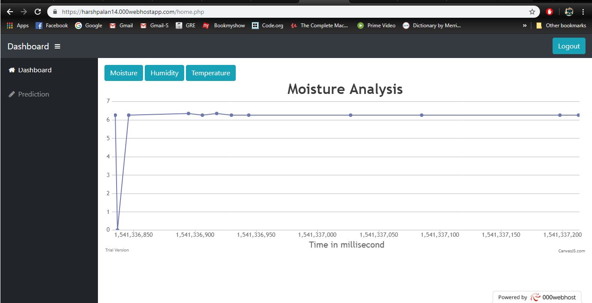
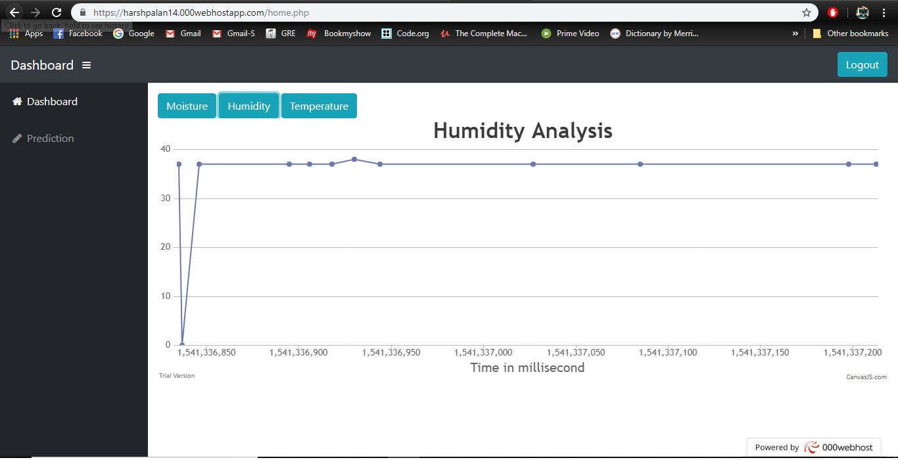
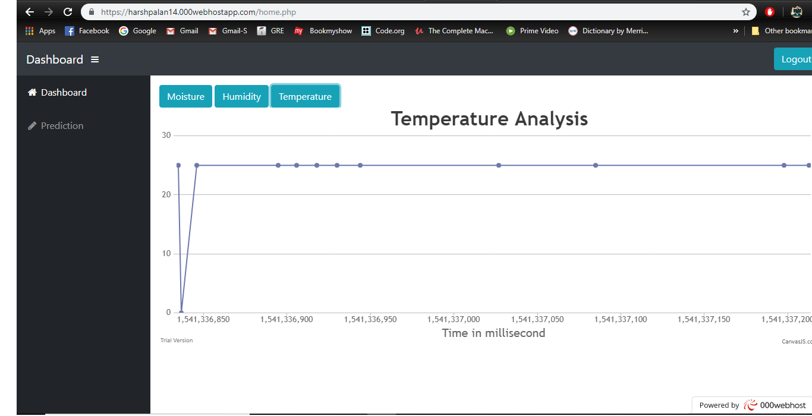

# Mist

A website that shows the graph of temperature, humidity and soil moisture against time from the series of data collected by sensors attached to RPi. 

https://harshpalan14.000webhostapp.com/

# Screenshots:

**Moisture**

**Humidity**

**Temperature**

